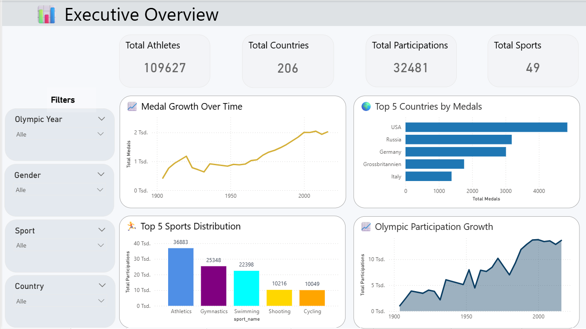
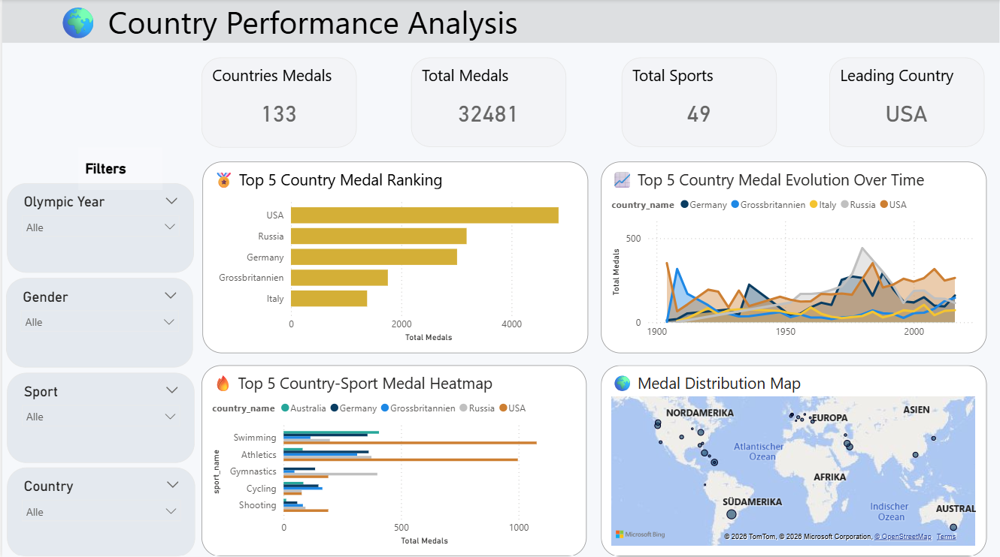
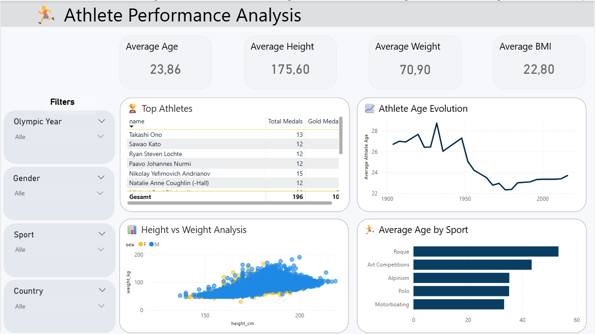
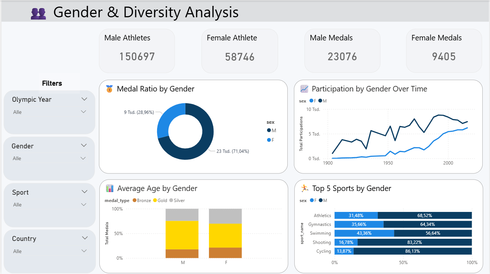
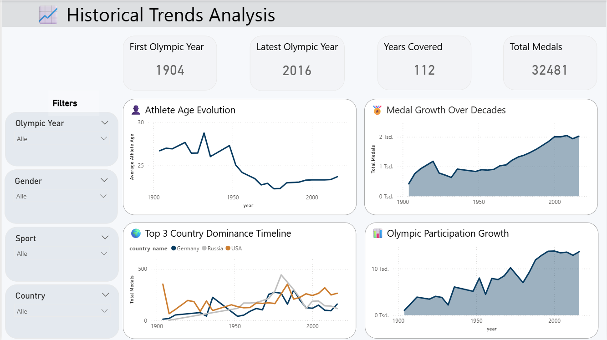
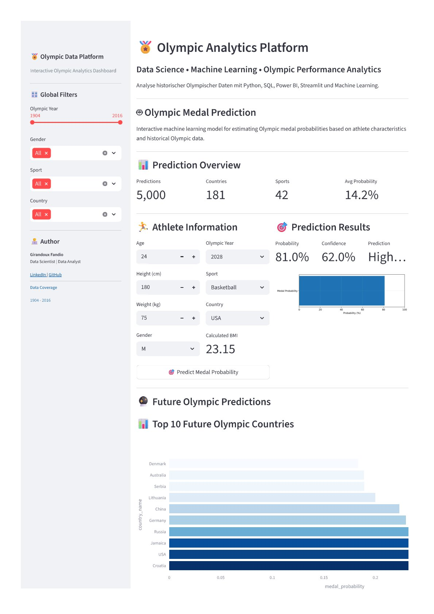
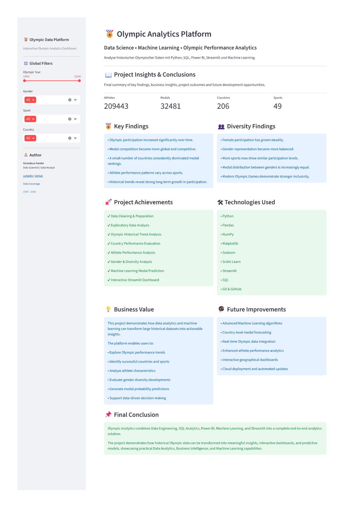

---

# 🏅 Olympic Analytics Platform

## 📌 Projektübersicht

Die **Olympic Analytics Platform** ist ein vollständiges End-to-End Data-Analytics- und Machine-Learning-Projekt zur Analyse historischer Olympischer Spiele.

Das Projekt kombiniert:

* 📊 Data Analytics
* 🗄️ SQL & PostgreSQL
* 📈 Power BI Dashboards
* 🐍 Python Data Science
* 🤖 Machine Learning
* 🌐 Streamlit Web Application

Ziel des Projekts ist die Analyse historischer Olympischer Daten, die Visualisierung globaler Sporttrends sowie die Entwicklung eines Machine-Learning-Modells zur Vorhersage von Medaillenchancen.

---

# 🚀 Projektziele

Dieses Projekt beantwortet unter anderem folgende Fragestellungen:

* Welche Länder dominieren die Olympischen Spiele?
* Wie haben sich Medaillenverteilungen historisch entwickelt?
* Welche Sportarten sind am erfolgreichsten?
* Wie unterscheiden sich männliche und weibliche Athleten?
* Welche Faktoren beeinflussen den Gewinn einer Medaille?
* Kann Machine Learning olympische Medaillenchancen vorhersagen?

---

# 🧱 Projektarchitektur

```text
Olympic-Analytics-Platform/
│
├── 01_data/
├── 02_sql_database/
├── 03_powerbi_dashboard/
├── 04_python_ml/
├── 05_streamlit_app/
├── 06_screenshots/
├── 07_docs/
│
├── LICENSE.txt
├── README.md
├── requirements.txt
└── .gitignore
```

---

# 🗂️ Projektstruktur

## 📁 01_data

Enthält Rohdaten sowie bereinigte und normalisierte Datenmodelle.

```text
01_data/
│
├── raw/
│   └── olympics.csv
│
└── processed/
    ├── dim_athletes.csv
    ├── dim_countries.csv
    ├── dim_date.csv
    ├── dim_events.csv
    ├── dim_medals.csv
    ├── dim_sports.csv
    ├── fact_participations.csv
    ├── olympics_analysis.csv
    ├── olympics_BI_cleaned.csv
    └── olympics_ML_cleaned.csv
```

---

# 🗄️ SQL & PostgreSQL Datenbank

## 📁 02_sql_database

Enthält die komplette PostgreSQL-Datenbankstruktur.

### Inhalte

* Datenbankschema
* Tabellenstruktur
* CSV-Importe
* Datenvalidierung
* SQL-Analysen

```text
02_sql_database/
│
├── 01_schema_creation.sql
├── 02_table_creation.sql
├── 03_csv_import.sql
├── 04_data_validation.sql
└── 05_analytics_queries.sql
```

---

# 📊 Power BI Dashboard

## 📁 03_powerbi_dashboard

Interaktives Business-Intelligence-Dashboard zur Analyse historischer Olympischer Daten.

### Enthaltene Seiten

| Seite                  | Beschreibung                       |
| ---------------------- | ---------------------------------- |
| 📊 Executive Overview  | KPI-Übersicht und globale Trends   |
| 🌍 Country Performance | Länder- und Medaillenanalysen      |
| 🏃 Athlete Performance | Athleten-Performance & Körperdaten |
| 👥 Gender Analysis     | Gender- und Diversitätsanalysen    |
| 📈 Historical Trends   | Historische Entwicklungen          |
| 📖 Project Insights    | Zusammenfassungen & Erkenntnisse   |

### Dateien

```text
03_powerbi_dashboard/
│
├── Olympic_Analytics.pbix
├── dax_measures.txt
└── powerbi_theme.json
```

---

# 🐍 Python & Machine Learning

## 📁 04_python_ml

Komplette Python- und Machine-Learning-Pipeline.

### Bestandteile

* Datenexploration
* Datenbereinigung
* Feature Engineering
* Visualisierung
* Modelltraining
* Modellbewertung

```text
04_python_ml/
│
├── notebooks/
│   ├── 01_data_exploration_visualization.ipynb
│   ├── 02_machine_learning.ipynb
│   └── 03_model_evaluation.ipynb
│
├── models/
│   └── olympic_medal_model.pkl
│
└── outputs/
    ├── feature_importance.png
    ├── confusion_matrix.png
    └── model_metrics.csv
```

---

# 🤖 Machine Learning Modell

## Verwendete Features

Das ML-Modell nutzt folgende Attribute:

* Alter
* Größe
* Gewicht
* BMI
* Geschlecht
* Sportart
* Land
* Olympisches Jahr

## Ziel

Vorhersage der Wahrscheinlichkeit eines Medaillengewinns.

---

# 🌐 Streamlit Web Application

## 📁 05_streamlit_app

Interaktive Data-Analytics-Webplattform mit Streamlit.

### Streamlit Seiten

| Seite                  | Beschreibung                |
| ---------------------- | --------------------------- |
| 📊 Executive Overview  | Hauptdashboard              |
| 🌍 Country Performance | Länderanalyse               |
| 🏃 Athlete Performance | Athletenanalyse             |
| 👥 Gender Analysis     | Genderanalyse               |
| 📈 Historical Trends   | Historische Trends          |
| 🤖 Medal Prediction    | Machine-Learning-Vorhersage |
| 📖 Project Insights    | Projektzusammenfassung      |

---

## Streamlit Projektstruktur

```text
05_streamlit_app/
│
├── app.py
│
├── pages/
│   ├── 0_Executive_Overview.py
│   ├── 1_Country_Performance.py
│   ├── 2_Athlete_Performance.py
│   ├── 3_Gender_Analysis.py
│   ├── 4_Historical_Trends.py
│   ├── 5_Medal_Prediction.py
│   └── 6_Project_Insights.py
│
├── data/
│   ├── future_olympic_predictions.parquet
│   ├── olympics_BI_cleaned.csv
│   └── olympics_ML_cleaned.csv
│
├── models/
│   └── olympic_medal_model.pkl
│
├── images/
│   ├── logo.png
│   └── olympics_banner.png
│
└── requirements.txt
```

---

# 📷 Dashboard Screenshots

## 📊 Power BI

### Executive Overview



---

### Country Performance



---

### Athlete Performance



---

### Gender Analysis



---

### Historical Trends



---

# 🌐 Streamlit Application

### Medal Prediction



---

### Project Insights



---

# 📚 Dokumentation

## 📁 07_docs

```text
07_docs/
│
├── Project_Report.pdf
├── Data_Dictionary.xlsx
├── ERD_Model.png
├── Project_Presentation.pdf
└── Technical_Documentation.pdf
```

---

# 🛠️ Technologien

## Verwendete Tools & Technologien

| Bereich            | Technologien        |
| ------------------ | ------------------- |
| Datenbank          | PostgreSQL          |
| Analytics          | SQL                 |
| BI Dashboard       | Power BI            |
| Programmiersprache | Python              |
| Data Science       | Pandas, NumPy       |
| Visualisierung     | Matplotlib, Seaborn |
| Machine Learning   | Scikit-Learn        |
| Web App            | Streamlit           |
| Versionskontrolle  | Git & GitHub        |

---

# ⚙️ Installation

## Repository klonen

```bash
git clone https://github.com/Girandoux/Olympic-Analytics-Platform.git
```

---

## Projektordner öffnen

```bash
cd Olympic-Analytics-Platform
```

---

## Abhängigkeiten installieren

```bash
pip install -r requirements.txt
```

---

# ▶️ Streamlit starten

```bash
cd 05_streamlit_app

streamlit run app.py
```

---

# 📈 Projekt-Highlights

✅ End-to-End Data Project
✅ PostgreSQL Datenbankdesign
✅ SQL Analytics
✅ Interaktive Power BI Dashboards
✅ Machine Learning Modell
✅ Streamlit Web App
✅ Professionelle GitHub-Struktur
✅ Vollständige Dokumentation

---

# 👨‍💻 Autor

## Girandoux Fandio

Data Scientist / Data Analyst

* LinkedIn
* GitHub

---

# 📄 Lizenz

Dieses Projekt steht unter der MIT-Lizenz.

Weitere Informationen siehe:

```text
LICENSE.txt
```

---

# ⭐ Projektstatus

✅ Projekt abgeschlossen
✅ Vollständig dokumentiert
✅ Portfolio-ready
✅ GitHub-ready
✅ End-to-End Data Science Projekt
